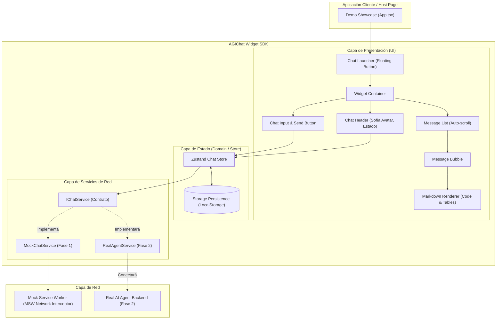
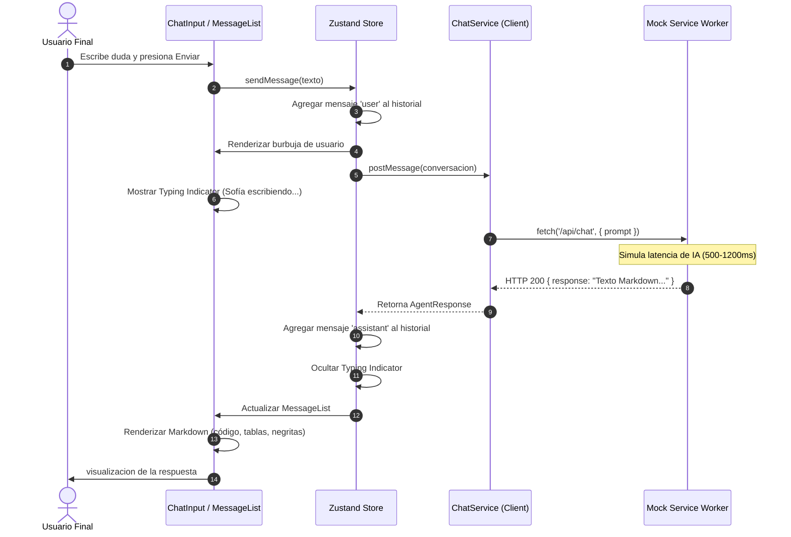

# Arquitectura del Sistema: AGIChat SDK & Widget

Este documento detalla la arquitectura de software adoptada para el desarrollo del Widget de Chat / SDK de AGIChat. Está diseñado para brindar una experiencia fluida a los usuarios, permitir el trabajo colaborativo en paralelo, y asegurar una transición limpia hacia la Fase 2 (conexión con un agente inteligente real).

---

## 1. Justificación de la Arquitectura

Para satisfacer la necesidad solicitada, la cual es crear un widget integrable como SDK con alta confiabilidad y preparación para un agente real, se ha implementado una Arquitectura por Capas Desacopladas adaptada a frontend:

1. **Capa de Presentación (UI / Widget)**:
   - Construida con React, Tailwind CSS, Radix UI y Framer Motion.
   - Los componentes de la interfaz son puramente presentacionales, lo que permite probarlos de forma aislada mediante React Testing Library sin depender de servidores o APIs externas.
   - Basado en el wireframe, el widget se encapsula para poder funcionar tanto como botón flotante en sitios web de clientes como en contenedores embebidos dentro de una misma página.

2. **Capa de Dominio y Estado (Zustand Store)**:
   - Se utiliza Zustand como único origen de la verdad (Single Source of Truth) para el historial de mensajes, estado de conexión y sesión.
   - Posee middleware de persistencia en `localStorage` para que la conversación no se pierda al recargar la página.
   - Esta capa no conoce los detalles de la interfaz visual; únicamente expone acciones (`sendMessage`, `receiveMessage`, `clearHistory`).

3. **Capa de Infraestructura y Red (MSW & ChatService)**:
   - Se implementa el patrón Service Abstraction mediante la interfaz IChatService.
   - Durante la Fase 1, la implementación `MockChatService` se comunica mediante `fetch` contra el endpoint interceptado por MSW (Mock Service Worker) a nivel de red del navegador.
   - **Ventaja para la Fase 2**: El código de los componentes UI y del store no requerirá cambios para conectarse al agente real; únicamente se sustituirá la configuración del servicio de red apuntando al nuevo endpoint o WebSocket.

4. **Capa de Contenido Enriquecido (Markdown Engine)**:
   - El agente devolverá respuestas con sintaxis Markdown. El intérprete integrado (`react-markdown` + `remark-gfm` + `rehype-highlight`) procesa de manera segura bloques de código con sintaxis coloreada, tablas, listas y enlaces.

---

## 2. Diagrama de Arquitectura de Alto Nivel



---

## 3. Diagrama de Secuencia: Flujo de Interacción de Mensajes



---

## 4. Estructura del Proyecto y Guía de Escalabilidad

La estructura de carpetas está modularizada para evitar colisiones de archivos en Git y permitir a los desarrolladores trabajar de forma concurrente:

```plaintext
Proyecto_1_AIEC/
├── .github/
│   └── workflows/
│       └── ci.yml                     # Pipeline CI (Lint, Test Coverage >=80%, Build)
├── public/                            # Recursos estáticos (logos, service worker)
├── src/
│   ├── assets/                       # Iconos vectoriales y recursos visuales
│   ├── components/
│   │   ├── common/                   # [Dev 1] Componentes atómicos (Button, Avatar, Badge)
│   │   ├── markdown/                 # [Dev 4] Renderizador de Markdown y bloques de código
│   │   └── widget/                   # [Dev 3] Componentes específicos del Chat Widget
│   │       ├── ChatHeader.tsx        # Cabecera con Sofía y controles
│   │       ├── ChatInput.tsx         # Barra de entrada de texto accesible
│   │       ├── ChatLauncher.tsx      # Botón flotante para abrir/cerrar
│   │       ├── MessageBubble.tsx     # Burbuja de mensaje con estados
│   │       ├── MessageList.tsx       # Lista con autoscroll al fondo
│   │       ├── TypingIndicator.tsx   # Animación de tres puntos pulsantes
│   │       └── AGIChatWidget.tsx     # Contenedor raíz del widget
│   ├── mocks/                        # [Dev 2] MSW Handlers y respuestas simuladas
│   │   ├── browser.ts                # Inicialización del worker en navegador
│   │   ├── handlers.ts               # Endpoints simulados (/api/chat)
│   │   └── mockData.ts               # Respuestas predefinidas de Sofía
│   ├── services/                     # [Dev 2] Abstracción de red y cliente API
│   │   ├── chatService.ts            # Implementación con fetch / MSW
│   │   └── types.ts                  # Interfaces de red (IChatService, Request, Response)
│   ├── store/                        # [Dev 2] Gestión de estado con Zustand
│   │   ├── types.ts                  # Modelos de dominio (Message, SessionState)
│   │   └── useChatStore.ts           # Store global con middleware persist
│   ├── sdk/                          # [Dev 4] Exportación del SDK para clientes
│   │   ├── index.ts                  # Punto de entrada de la librería
│   │   └── types.ts                  # Props y opciones de configuración
│   ├── demo/                         # [Dev 4] Aplicación web de demostración para inversores
│   │   └── DemoApp.tsx
│   ├── test/                         # Configuración y suites de pruebas (Vitest + RTL)
│   │   ├── setupTests.ts             # Configuración global de jest-dom
│   │   ├── smoke.test.ts             # Prueba básica de entorno
│   │   └── components/               # Pruebas unitarias de componentes
│   ├── App.tsx                       # Vista de demostración principal
│   ├── index.css                     # Directivas Tailwind y estilos de scroll
│   ├── main.tsx                      # Bootstrap de React
│   └── vite-env.d.ts                 # Declaraciones de tipos de Vite
├── AGENTS.md                         # Guía de estándares para agentes de IA
├── ARQUITECTURA.md                   # Este documento de arquitectura
├── README.md                         # Instrucciones de ejecución rápida
├── eslint.config.js                  # Reglas de estilo y calidad de código
├── package.json                      # Scripts y dependencias
├── tailwind.config.js                # Tokens de diseño y colores corporativos
├── tsconfig.json                     # Reglas de TypeScript estricto
└── vitest.config.ts                  # Configuración de pruebas y umbral de cobertura >=80%
```

---

## 5. Criterios de Calidad y Verificación

- **Cobertura de Código**: Cada nuevo archivo añadido en `src/` debe incluir su archivo de prueba correspondiente en `src/test/` o junto al componente. El comando `npm run test:coverage` debe mantener un mínimo de **80%** en líneas, ramas, funciones y sentencias.
- **Formato y Estilo**: Todo cambio debe pasar `npm run lint` y `npm run format:check` antes de solicitar revisión grupal (PR).
- **Compilación Limpia**: No se admiten tipos `any` injustificados ni errores en `npm run build`.
