# Explicación de la Opción C — AGIChat

## 1. Responsabilidad asignada

La opción C comprendió el renderizador Markdown, el SDK reusable, el portal demo para inversionistas y las pruebas de integración/E2E. El trabajo se desarrolló en `feat/markdown-sdk-and-demo` y posteriormente se rebasó sobre `main` para incorporar la opción A.

## 2. Arquitectura y flujo

```mermaid
flowchart LR
    Demo[DemoApp] --> SDK[AGIChatWidget]
    SDK --> Widget[ChatWidget]
    Widget --> Input[ChatInput]
    Input --> Service[HttpChatService]
    Service --> API[POST /api/chat]
    API --> MSW[MSW Mock API]
    MSW --> Response[Respuesta Markdown]
    Response --> Store[Zustand]
    Store --> List[MessageList]
    List --> Renderer[MarkdownRenderer]
```



La interfaz no genera respuestas directamente. El flujo pasa por `HttpChatService`, luego por MSW y finalmente regresa al store de Zustand. Esto prepara la aplicación para sustituir MSW por un agente real en el proyecto 2.

## 3. Fase 1: renderizador Markdown

Se creó `src/components/markdown/MarkdownRenderer.tsx` utilizando `react-markdown`, `remark-gfm`, `rehype-highlight` y `highlight.js`.

El asistente puede renderizar títulos, negritas, cursivas, listas, citas, tablas, bloques de código y enlaces externos. Los enlaces utilizan `target="_blank"` y `rel="noopener noreferrer"`.

También se creó `src/components/markdown/CodeBlock.tsx`, que agrega nombre del lenguaje, botón “Copiar código”, confirmación de copiado y mensaje de error si el navegador no permite copiar.

Solo los mensajes del asistente se procesan como Markdown. Los mensajes del usuario permanecen como texto literal.

## 4. Fase 2: SDK reusable

Se creó el punto de entrada público en `src/sdk/index.ts`. El componente principal es:

```tsx
<AGIChatWidget
  agentName="Luna"
  welcomeMessage="¿En qué puedo ayudarte?"
  position="bottom-right"
  theme="dark"
/>
```

Las propiedades disponibles son:

- `agentName`: nombre del agente.
- `welcomeMessage`: mensaje de bienvenida.
- `avatarUrl`: avatar personalizado.
- `position`: `bottom-right`, `bottom-left`, `top-right` o `top-left`.
- `theme`: tema claro, oscuro o colores personalizados.

Los temas usan variables CSS como `--agichat-primary`, `--agichat-surface`, `--agichat-text` y `--agichat-border`, permitiendo cambiar colores durante la ejecución.

Vite genera un bundle ES Module, un bundle UMD, una hoja de estilos distribuible y declaraciones TypeScript. El comando es:

```bash
npm run build:sdk
```

Los artefactos se generan en `dist-sdk/`.

## 5. Fase 3: portal demo

Se creó `src/demo/DemoApp.tsx`, un portal de demostración para inversionistas que utiliza el mismo `AGIChatWidget` que consumiría un cliente externo.

El portal permite:

- Cambiar el nombre del agente.
- Cambiar el tema.
- Cambiar la posición.
- Probar respuestas con tablas.
- Probar respuestas con bloques de código.
- Simular una caída de red.
- Limpiar la conversación.

## 6. Escenarios MSW

`src/mocks/demoScenario.ts` controla los escenarios `default`, `table`, `code` y `error`.

El escenario `table` devuelve una tabla Markdown con métricas. El escenario `code` devuelve un bloque TypeScript para probar el resaltado y el copiado. El escenario `error` devuelve HTTP `503` para comprobar el manejo de fallos.

Cuando ocurre el error, el mensaje se marca con `status: 'error'` y se muestra “No se pudo enviar”.

## 7. Integración con la opción A

Al fusionarse la opción A, la rama se actualizó mediante rebase. La opción C conserva y utiliza:

- `sendMessage`.
- `receiveMessage`.
- `markMessageAsSent`.
- `markMessageAsError`.
- Persistencia de Zustand.
- `HttpChatService`.
- MSW.

También se corrigió la compatibilidad de MSW con JSDOM agregando `ReadableStream`, `TransformStream` y `WritableStream` en `src/test/setupTests.ts`.

## 8. Fase 4: prueba E2E

Se creó `src/test/e2e/AGIChatFlow.test.tsx`, que verifica el flujo completo:

1. Abrir el widget.
2. Escribir una pregunta.
3. Enviar el mensaje.
4. Interceptar la solicitud con MSW.
5. Recibir una respuesta Markdown.
6. Detectar el bloque de código.
7. Copiar el código.
8. Confirmar “Código copiado”.
9. Reiniciar el chat.
10. Verificar que la conversación se limpió.

Los comandos son:

```bash
npm run test:e2e
npm run test:coverage
```

## 9. Validación

La versión final alcanzó:

- 53 pruebas aprobadas.
- 95.32 % de cobertura de statements.
- 91.83 % de cobertura de branches.
- 94.87 % de cobertura de funciones.
- ESLint aprobado.
- Build principal aprobado.
- Build del SDK aprobado.
- Prueba E2E aprobada.

## 10. Commits principales

```text
df0091e feat: agregar renderizador markdown enriquecido
0d88c67 feat: exponer widget configurable como sdk
86935cf fix: preparar streams web para pruebas de MSW
41dce46 feat: agregar portal demo interactivo
de87ce8 test: cubrir flujo e2e completo del widget
```

## 11. Explicación breve para la presentación

Mi responsabilidad fue desarrollar la capa de contenido enriquecido, el SDK reusable, el portal demostrativo y las pruebas E2E. Implementé un renderizador Markdown seguro con soporte para tablas y código, encapsulé el widget como un componente configurable, construí un showcase para demostrar distintos escenarios de respuesta y validé el flujo completo usando MSW, Zustand, Vitest y React Testing Library. La integración se realizó sobre el servicio abstracto del equipo, por lo que la interfaz queda preparada para cambiar posteriormente de la API simulada a un agente real.
